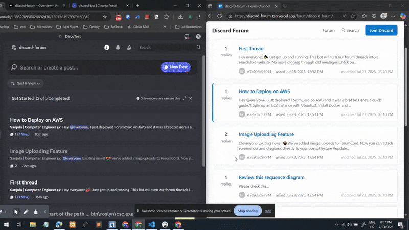

# Discord Forum
)
)
## Demo



## Why and What is this ?

During the time of my internship, I noticed that so much knowledge was being lost in the Discord server. And it is not accessible via Search Engines. So I decided to create a system that mirrors the internal Discord forum to a static website. This way, the knowledge is preserved and can be accessed by anyone, even those who are not part of the Discord server.

## How It Works?
The system is made up of two main parts:

- Discord Bot: This bot connects to the Discord server, fetches forum posts, processes them (like sanitizing content and handling images), and stores them in a database.
- Static Web App: The web app takes the data from the database and generates a static website. It’s styled like StackOverflow, making it easy to browse and search through the content.

The bot keeps the site updated by syncing new or updated posts periodically. The web app is then hosted on platforms like Netlify or GitHub Pages for easy access.


### PIIs, Sensitive Data, and Privacy?

No personal information (PII) is stored. User IDs are hashed, and only aliases are saved.
Private or restricted content is excluded from the sync.
We comply with Discord's API terms of service.
All content is sanitized to remove mentions, emojis, and any sensitive data.

## TechStack

- Node.js, TypeScript, Discord.js, Astro, MySQL, Tailwind CSS

## Features

### Discord Bot
- **Forum Mirroring**: Syncs Discord forum threads and posts to a database.
- **Smart Sync**: Automatically decides between full or incremental syncs.
- **Image Processing**: Converts images to WebP and uploads them to S3.
- **Content Sanitization**: Removes mentions, emojis, and sensitive data.
- **Moderation Tools**: Includes a moderation queue and approval workflows.
- **Staff Management**: Manage staff roles via CSV or REST API.

### Web App
- **Static Site Generation**: Converts database content into a static site.
- **SEO Optimized**: Includes meta tags, JSON-LD, and semantic HTML.
- **Responsive Design**: Built with Tailwind CSS for a clean, mobile-friendly UI.
- **Promotional Banner**: Displays a configurable Discord invite banner.

## Quick Start

### Prerequisites
- Node.js 20+
- MySQL 8.0+
- Discord Bot Token
- AWS S3 account (optional for image uploads)

### Setup
1. Clone the repository:
   ```bash
   git clone <repository-url>
   cd discord-forum
   ```
2. Install dependencies:
   ```bash
   npm install
   ```
3. Configure your `.env` file with the required credentials.
4. Initialize the database:
   ```bash
   mysql -u root -p forum < init-db.sql
   ```
5. Start the bot:
   ```bash
   npm run dev
   ```

### Web App
1. Navigate to the `web-app` folder.
2. Install dependencies:
   ```bash
   npm install
   ```
3. Build the static site:
   ```bash
   npm run build
   ```
4. Deploy the `dist/` folder to your preferred hosting platform.
